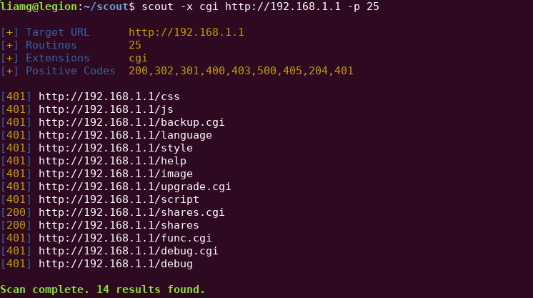

# Scout

[](https://travis-ci.org/liamg/scout)

Scout is a URL fuzzer for discovering undisclosed VHOSTS, files and directories on a web server. 

<p align="center">
  
</p>

A full word list is included in the binary, meaning maximum portability and minimal configuration. Aim and fire!

## Usage

```bash


Usage:
  scout [command]

Available Commands:
  help        Help about any command
  url         Discover URLs on a given web server.
  vhost       Discover VHOSTs on a given web server.

Flags:
  -d, --debug             Enable debug logging.
  -h, --help              help for scout
  -n, --no-colours        Disable coloured output.
  -p, --parallelism int   Parallel routines to use for sending requests. (default 10)
  -k, --skip-ssl-verify   Skip SSL certificate verification.
  -w, --wordlist string   Path to wordlist file. If this is not specified an internal wordlist will be used.

Use "scout [command] --help" for more information about a command.

```


### Discover URLs

```bash
$ scout url http://192.168.1.1
  
  [+] Target URL      http://192.168.1.1
  [+] Routines        10 
  [+] Extensions      php,htm,html 
  [+] Positive Codes  200,302,301,400,403,500,405,204,401,301,302
  
  [302] http://192.168.1.1/css
  [302] http://192.168.1.1/js
  [302] http://192.168.1.1/language
  [302] http://192.168.1.1/style
  [302] http://192.168.1.1/help
  [401] http://192.168.1.1/index.htm
  [302] http://192.168.1.1/image
  [200] http://192.168.1.1/log.htm
  [302] http://192.168.1.1/script
  [401] http://192.168.1.1/top.html
  [200] http://192.168.1.1/shares
  [200] http://192.168.1.1/shares.php
  [200] http://192.168.1.1/shares.htm
  [200] http://192.168.1.1/shares.html
  [401] http://192.168.1.1/traffic.htm
  [401] http://192.168.1.1/reboot.htm
  [302] http://192.168.1.1/debug
  [401] http://192.168.1.1/debug.htm
  [401] http://192.168.1.1/debug.html
  [401] http://192.168.1.1/start.htm
  
  Scan complete. 28 results found. 

```

### Discover VHOSTs

```bash
$ scout vhost https://google.com
  
  [+] Base Domain     google.com
  [+] Routines        10 
  [+] IP              -
  [+] Port            - 
  [+] Using SSL       true
  
  account.google.com
  accounts.google.com
  blog.google.com
  code.google.com
  dev.google.com
  local.google.com
  m.google.com
  mail.google.com
  mobile.google.com
  www.google.com
  admin.google.com
  chat.google.com
  
  Scan complete. 12 results found.

```

## Installation

```bash
curl -s "https://raw.githubusercontent.com/liamg/scout/master/scripts/install.sh" | bash
```
